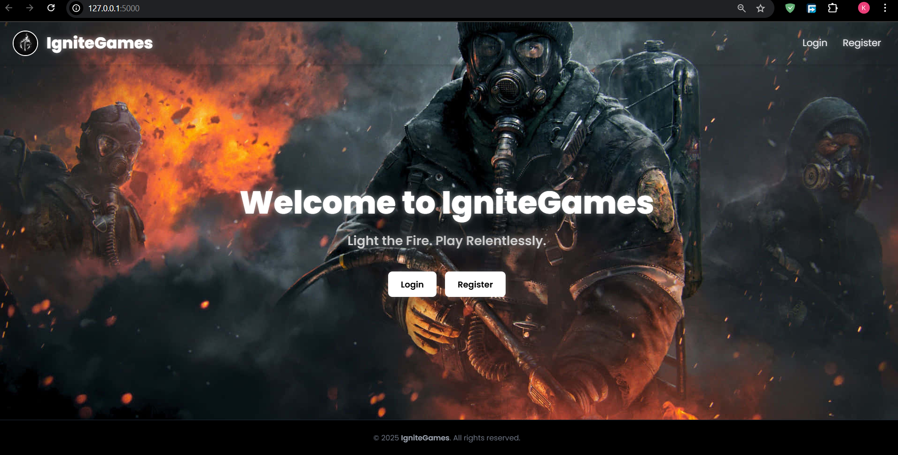
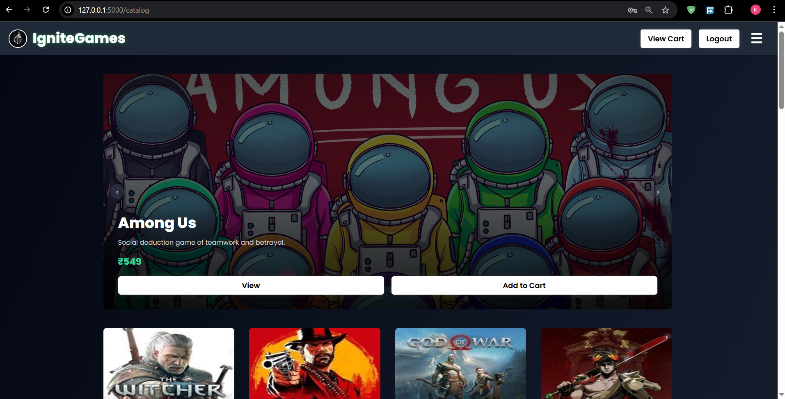
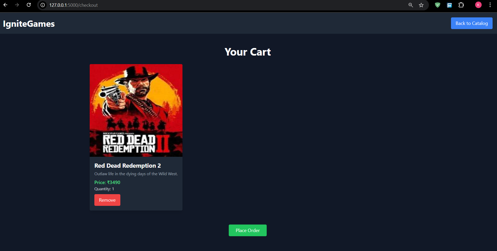

---

# IgniteGames - E-Commerce Platform

IgniteGames is a dynamic e-commerce platform that offers a wide variety of digital games for purchase. Built with Flask, Tailwind CSS, and modern web technologies, this platform provides an immersive and seamless shopping experience. Users can browse products, manage their cart, and place orders with integrated payment gateways like Razorpay and PhonePe.

## Features

- **User Authentication**: Secure user login and registration with JWT-based authentication.
- **Product Catalog**: Browse a wide selection of games with detailed descriptions, images, and prices.
- **Cart Management**: Add, remove, and manage the cart with a dynamic interface.
- **Order Placement**: Place orders for products and handle the payment seamlessly through Razorpay.
- **Payment Integration**: Secure payment gateway integration with Razorpay for smooth transactions.
- **Responsive Design**: Fully responsive, modern UI using Tailwind CSS.

## Tech Stack

- **Frontend**: HTML, Tailwind CSS, JavaScript
- **Backend**: Flask, Python
- **Database**: MongoDB (MongoDB Atlas)
- **Payment Gateways**: Razorpay
- **Authentication**: JWT (JSON Web Tokens)

## Installation

Follow the steps below to set up the project locally:

### Prerequisites

1. **Python** (3.7+)
2. **MongoDB** (Install MongoDB locally or create an Atlas cluster)
3. **Node.js** (For managing frontend dependencies)

### Step-by-Step Installation

1. **Clone the Repository**:

   ```bash
   git clone https://github.com/Kartik5199/ignitegames.git
   cd ignitegames
   ```

2. **Install Python Dependencies**:

   ```bash
   pip install -r requirements.txt
   ```

3. **Setup MongoDB**:
   - If you're using **MongoDB Atlas**, create a cluster and configure the connection URI.
   - If you're using a **local MongoDB server**, ensure MongoDB is running.

4. **Frontend Setup**:
   - Navigate to the `static/js` folder and ensure that your frontend JavaScript is compiled or set up as needed.
   
   If you're using **Tailwind CSS**:
   ```bash
   npm install
   ```

5. **Environment Variables**:
   - Create a `.env` file in the root directory and configure the necessary variables:
   
   ```bash
   MONGO_URI=your-mongodb-uri
   JWT_SECRET_KEY=your-jwt-secret-key
   ```

6. **Run the Application**:

   ```bash
   python main.py
   ```

   - The app should now be running on `http://localhost:5000`.

## Features Walkthrough

### **User Registration & Login**

- Register and log in with email and password.
- JWT tokens are used for session management.

### **Browse & Search for Games**

- View a dynamic catalog of games, with rich details including name, description, price, and image.

### **Cart Management**

- Add and remove games from the cart.
- View the details of items in the cart, including quantity and total price.

### **Place Orders**

- Proceed to the checkout page to review your order.
- Payments are processed securely using Razorpay.

### **Payment Integration**

- Razorpay payment gateways are integrated for secure transactions.

### **Responsive Design**

- The platform is fully responsive and optimized for mobile, tablet, and desktop use.

## Screenshots

### 1. **Checkout Page**
   

### 2. **Catalog Page**
   

### 3. **Checkout Page**
   

## Contribution

We welcome contributions to IgniteGames! Here’s how you can contribute:

1. Fork this repository.
2. Create a new branch (`git checkout -b feature-xyz`).
3. Commit your changes (`git commit -am 'Add feature xyz'`).
4. Push to the branch (`git push origin feature-xyz`).
5. Create a new Pull Request.

Please make sure to write tests for new features and follow the existing code conventions.

## License

This project is licensed under the MIT License.

---


